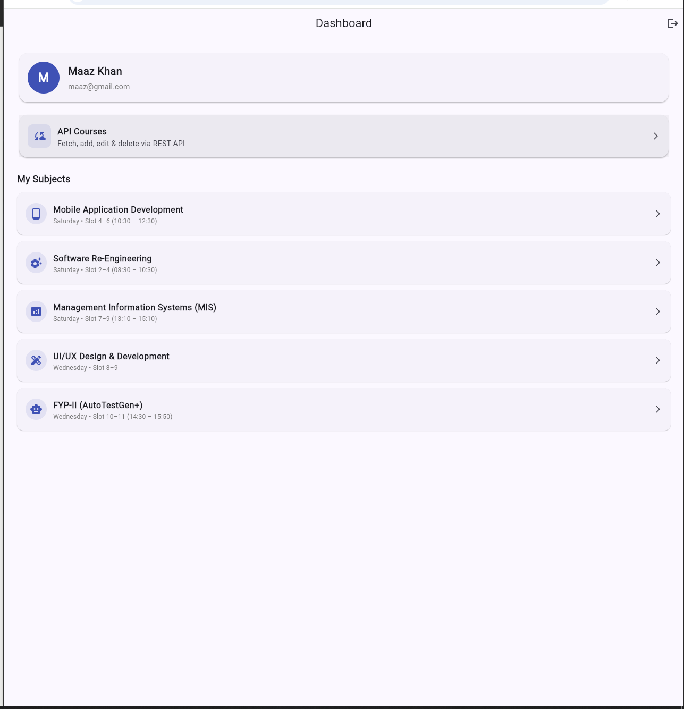
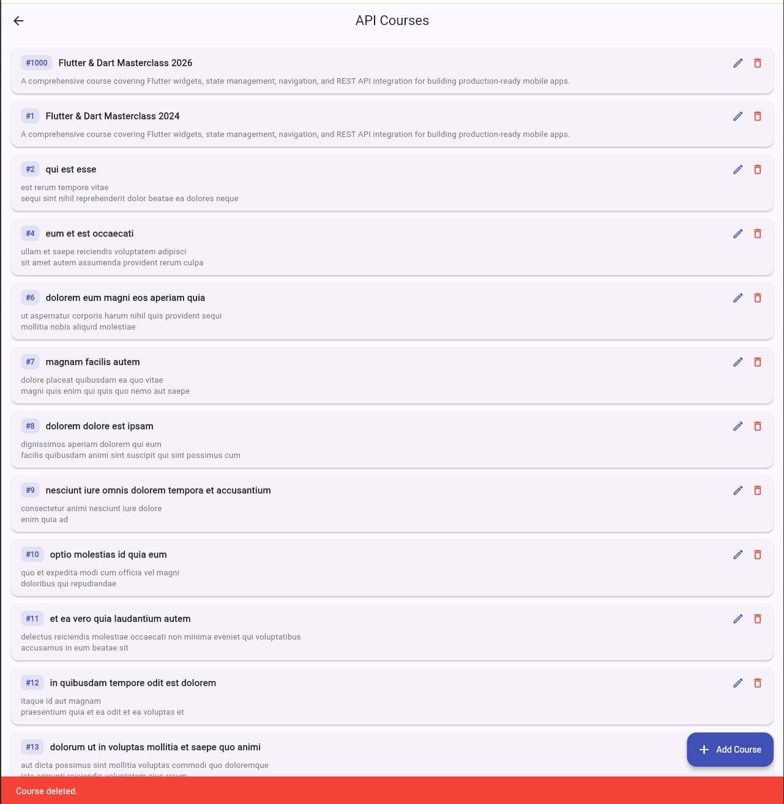
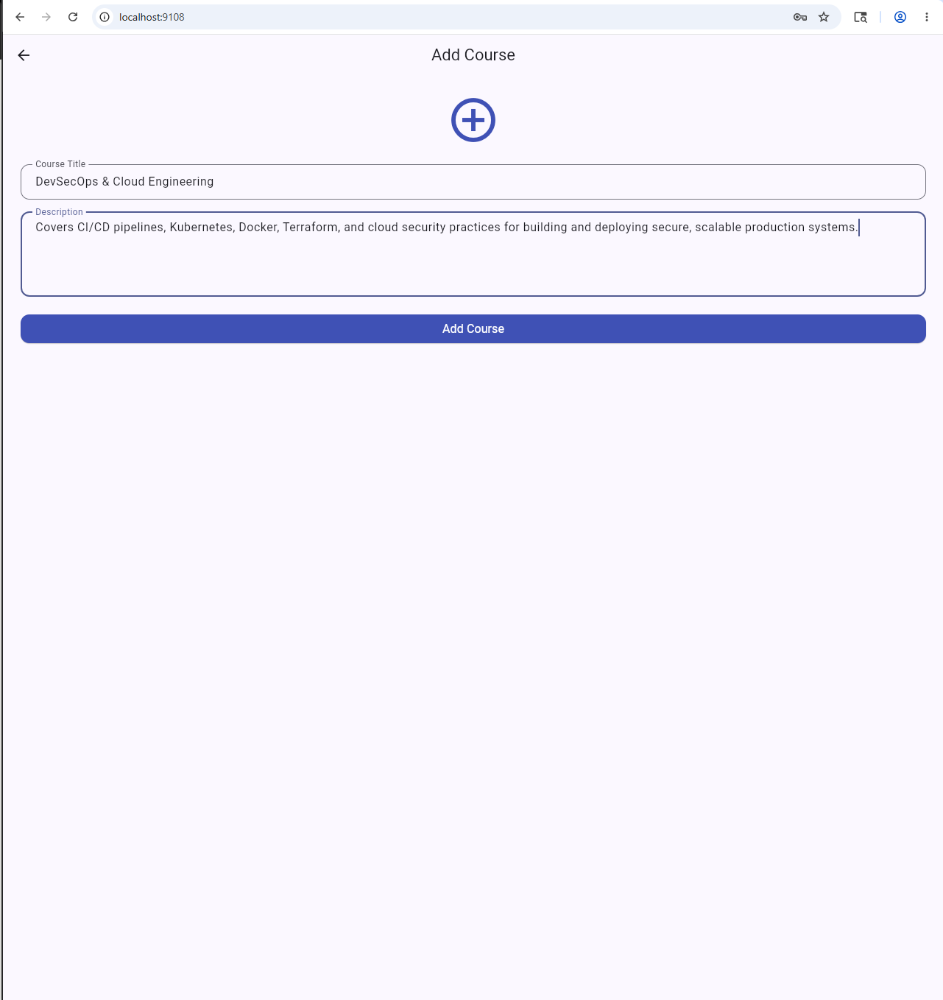
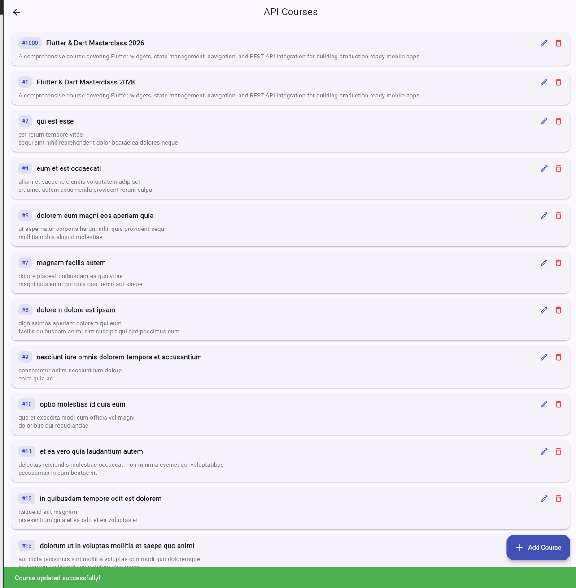
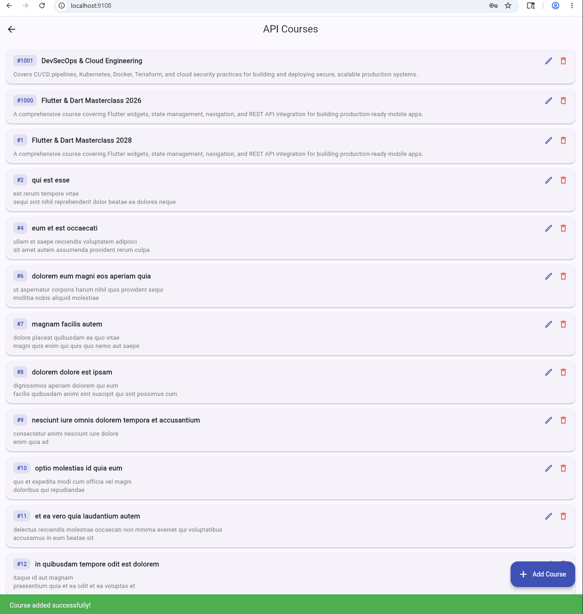

# 📱 Flutter Multi-Screen App

## 📘 Overview

A complete **multi-screen Flutter application** featuring **user authentication**, **form validation**, **navigation**, **course management**, and **full CRUD API integration** — built as a **coding assessment project** demonstrating professional Flutter development skills.

The app implements a full **registration → login → dashboard → detail** flow with **comprehensive input validation**, **separated business logic**, **reusable components**, and **clean architecture** following industry best practices.

The **Extension Assignment** adds **REST API integration** using the **JSONPlaceholder API**, implementing all four CRUD operations (Create, Read, Update, Delete) with a dedicated **service layer**, **enum-driven state management**, and proper **loading/error/success** state handling.

---

💼 This project is part of my **Mobile Application Development** coursework, highlighting **Flutter UI development**, **state management**, **multi-screen navigation proficiency**, and **REST API integration**.

---

## 🌐 API Integration

| Detail | Value |
|--------|-------|
| **API Used** | JSONPlaceholder — Free Fake REST API |
| **Base URL** | `https://jsonplaceholder.typicode.com` |
| **Endpoint** | `/posts` (mapped as courses) |
| **Documentation** | https://jsonplaceholder.typicode.com/guide |
| **Operations** | GET, POST, PUT, DELETE |

> **Note:** JSONPlaceholder is a free fake REST API for testing and development. POST/PUT/DELETE operations are simulated — responses are valid but data is not persisted server-side. Local state is managed in-memory after each API operation.

---

## 🌿 Branch

| Branch | Purpose |
|--------|---------|
| `main` | Original assessment — Auth, Forms, Navigation, Dashboard |
| `feature/course-api-integration` | Extension — Full CRUD API integration |

All CRUD API work is completed on the `feature/course-api-integration` branch as required.

---

## 🏗️ Architecture

```
lib/
├── main.dart                           # App entry point
├── models/
│   ├── user_model.dart                 # User data class
│   ├── subject_model.dart              # Subject data class (local)
│   └── api_course_model.dart           # API course model (NEW)
├── enums/
│   └── enums.dart                      # Gender enum + LoadState enum (UPDATED)
├── utils/
│   └── validators.dart                 # Reusable static validator class (UPDATED)
├── controllers/
│   └── auth_controller.dart            # Business logic (auth)
├── services/
│   └── course_service.dart             # REST API service layer (NEW)
├── screens/
│   ├── registration_screen.dart        # Registration form + validation
│   ├── login_screen.dart               # Login + remember me
│   ├── dashboard_screen.dart           # User info + subject list + API entry (UPDATED)
│   ├── detail_screen.dart              # Subject detail view
│   ├── api_courses_screen.dart         # CRUD course list screen (NEW)
│   └── add_edit_course_screen.dart     # Create / Edit course form (NEW)
└── widgets/
    └── custom_text_field.dart          # Reusable text field component (UPDATED)
```

### 🧩 Layer Separation

| **Layer** | **Responsibility** |
|-----------|-------------------|
| **Models** | Type-safe data classes — `UserModel`, `SubjectModel`, `ApiCourseModel` |
| **Enums** | `Gender` enum for dropdowns, `LoadState` enum for async state management |
| **Validators** | Static reusable validator class — separated from UI for testability |
| **Controllers** | `AuthController` handles registration, login, and user lookup logic |
| **Services** | `CourseService` handles all API calls (GET, POST, PUT, DELETE) — isolated from UI |
| **Screens** | One file per screen with clean widget composition and navigation |
| **Widgets** | `CustomTextField` reusable component — consistent styling across all forms |

---

## 📸 Screenshots

### 🔐 Authentication Flow

<p align="center">
  
  &nbsp;&nbsp;&nbsp;
  
  &nbsp;&nbsp;&nbsp;
  
</p>
<p align="center">
  <em>Registration Screen → Login Screen → Dashboard (with API Courses entry)</em>
</p>

### 📚 Subject Detail Screens

<p align="center">
  
  &nbsp;&nbsp;&nbsp;
  
  &nbsp;&nbsp;&nbsp;
  
</p>
<p align="center">
  <em>Mobile App Dev → UI/UX Design → FYP-II (AutoTestGen+)</em>
</p>

### 🌐 CRUD API Integration Screens

<p align="center">
  
  &nbsp;&nbsp;&nbsp;
  
  &nbsp;&nbsp;&nbsp;
  
</p>
<p align="center">
  <em>API Courses List → Add Course Form → Edit Course Form</em>
</p>

<p align="center">
  
  &nbsp;&nbsp;&nbsp;
  
</p>
<p align="center">
  <em>"Course added successfully!" → "Course deleted." snackbar feedback</em>
</p>

---

## ⚙️ Features Implemented

### Original Assessment

| **Screen** | **Key Features** |
|------------|-----------------|
| **Registration** | Full Name, Email, Password, Confirm Password, Gender dropdown with real-time validation |
| **Login** | Email/Password authentication, show/hide password toggle, Remember Me checkbox |
| **Dashboard** | User profile card with avatar, API Courses navigation card, dynamic subject list, logout with confirmation |
| **Detail** | Subject header with gradient banner, instructor info, course description, schedule, location |

### Extension — CRUD API Integration

| **Operation** | **HTTP Method** | **Endpoint** | **Behavior** |
|--------------|----------------|-------------|-------------|
| **Read** | `GET` | `/posts?_limit=20` | Fetches 20 courses, shows loading indicator, handles errors with retry |
| **Create** | `POST` | `/posts` | Sends new course, updates local list at top, shows success snackbar |
| **Update** | `PUT` | `/posts/{id}` | Pre-fills existing data, sends update, reflects changes in list |
| **Delete** | `DELETE` | `/posts/{id}` | Confirmation dialog, removes from list on success, shows snackbar |

---

## 🔒 Validation Rules

| **Field** | **Rules** |
|-----------|----------|
| **Full Name** | Required, minimum 2 characters |
| **Email** | Required, valid email format (regex validated) |
| **Password** | Minimum 6 characters, at least 1 uppercase, at least 1 special character |
| **Confirm Password** | Required, must match password field |
| **Gender** | Required dropdown selection |
| **Course Title** | Required, minimum 3 characters, maximum 100 characters |
| **Course Description** | Required, minimum 10 characters |

---

## 🗺️ Navigation Flow

```
Registration ──pushReplacement──► Login ──pushReplacement──► Dashboard ──push──► Detail
                                                                  │
                                                                  └──push──► ApiCoursesScreen
                                                                                    │
                                                                                    └──push──► AddEditCourseScreen
```

| **Navigation Type** | **When Used** | **Why** |
|---------------------|---------------|---------|
| `pushReplacement` | Auth screens | Prevents back-button access to unauthorized screens |
| `push` | Dashboard → Detail / API Courses | Allows natural back navigation |
| `Navigator.pop(result)` | AddEditCourse → ApiCourses | Returns course data to caller |

---

## 🔌 Service Layer — CourseService

```dart
class CourseService {
  CourseService._(); // Prevent instantiation

  static Future<List<ApiCourseModel>> fetchCourses()        // GET
  static Future<ApiCourseModel>       createCourse(...)     // POST
  static Future<ApiCourseModel>       updateCourse(course)  // PUT
  static Future<void>                 deleteCourse(id)      // DELETE
}
```

All methods include:
- **10-second timeout** on every request
- **TimeoutException** handling
- **SocketException** handling (no internet)
- **FormatException** handling (invalid response)
- Descriptive `Exception` messages surfaced to the UI

---

## 📊 State Handling

The `LoadState` enum drives all async UI states:

```dart
enum LoadState { loading, success, error }
```

| **State** | **UI Shown** |
|-----------|-------------|
| `loading` | `CircularProgressIndicator` centered |
| `error` | Error message + Retry button |
| `success` | Course list with edit/delete actions + Add FAB |

---

## 📚 Enrolled Subjects (Local Data)

| **Subject** | **Instructor** | **Day** | **Timing** | **Location** |
|-------------|---------------|---------|-----------|-------------|
| Mobile Application Development | Ms. Roshana Mughal (VF) | Saturday | Slot 4–6 (10:30 – 12:30) | CyS-Lab |
| Software Re-Engineering | Mr. Conrad D'Silva / Ms. Naureen Anwar (VF) | Saturday | Slot 2–4 (08:30 – 10:30) | SF-239 |
| Management Information Systems (MIS) | Mr. Muhammad Ahmed Qaiser (VF) | Saturday | Slot 7–9 (13:10 – 15:10) | SF-240 |
| UI/UX Design & Development | Dr. Raazia Sosan Waseem | Wednesday | Slot 8–9 | adv-AI Lab |
| FYP-II (AutoTestGen+) | Mam Soohan Abbasi | Wednesday | Slot 10–11 (14:30 – 15:50) | SF-224 |

---

## 🧠 Technical Highlights

🔸 **Service Layer — Full API Isolation**
*Approach:* `CourseService` with private constructor — all HTTP logic in one place.
*Benefit:* UI never touches `http` directly; service is independently testable.

🔸 **LoadState Enum — Declarative Async State**
*Approach:* `switch (_loadState)` drives the entire UI tree.
*Benefit:* Clean, exhaustive state handling — impossible to forget a case.

🔸 **Local ID Management for POST**
*Approach:* JSONPlaceholder always returns `id: 101` for POST. A `_nextLocalId` counter (starting at 1000) assigns unique IDs to locally-created courses.
*Benefit:* Prevents ID collisions in the local list while demonstrating real POST behavior.

🔸 **Pre-fill on Edit**
*Approach:* `AddEditCourseScreen` accepts optional `ApiCourseModel?` — null = Add mode, non-null = Edit mode with controllers pre-initialized.
*Benefit:* Single screen handles both create and update flows cleanly.

🔸 **mounted Guard on all async callbacks**
*Approach:* Every `setState` after `await` checks `if (!mounted) return`.
*Benefit:* Prevents `setState` on disposed widget errors.

🔸 **Custom Validator Class — Extended**
*Approach:* Added `validateCourseTitle` and `validateCourseBody` to existing `Validators` class.
*Benefit:* All validation centralized — no inline logic in any screen.

---

## 🧰 Tools & Technologies

| **Category** | **Tools / Technologies** |
|--------------|--------------------------|
| **Framework** | Flutter 3.x |
| **Language** | Dart |
| **Design System** | Material Design 3 |
| **HTTP Client** | `http` package (`^1.2.0`) |
| **API** | JSONPlaceholder (`jsonplaceholder.typicode.com`) |
| **IDE** | VS Code 1.121 |
| **Version Control** | Git / GitHub |
| **Testing Platforms** | Android Emulator, Chrome (Flutter Web) |

---

## 🚀 How to Run

1. **Ensure Flutter SDK is installed:**
   ```bash
   flutter --version
   ```

2. **Clone the repository:**
   ```bash
   git clone <your-repo-url>
   cd app
   ```

3. **Checkout the feature branch:**
   ```bash
   git checkout feature/course-api-integration
   ```

4. **Install dependencies:**
   ```bash
   flutter pub get
   ```

5. **Run on Android emulator:**
   ```bash
   flutter run
   ```

6. **Run on Chrome (web):**
   ```bash
   flutter run -d chrome
   ```

---

## 🎯 Assessment Checklist

### Original Requirements

| **Requirement** | **Status** |
|-----------------|-----------|
| Registration with all fields | ✅ Complete |
| Email validation | ✅ Regex validated |
| Password rules (6 chars, uppercase, special) | ✅ Complete |
| Confirm password matching | ✅ Complete |
| Gender dropdown with enum | ✅ Enum implemented |
| All fields required | ✅ Validated |
| Login with email/password | ✅ Complete |
| Show/hide password toggle | ✅ Eye icon |
| Remember Me checkbox | ✅ Complete |
| Dashboard with user info + avatar | ✅ Complete |
| Subject list with tap navigation | ✅ 5 subjects |
| Logout → back to login | ✅ With confirmation |
| Detail screen (header, banner, description, schedule) | ✅ Complete |
| Custom Validator Class | ✅ Separated |
| Enum Implementation | ✅ Gender enum |
| Controller Layer | ✅ AuthController |
| Clean folder structure | ✅ MVC-like |
| Runs without errors | ✅ Verified |

### Extension Requirements — CRUD API Integration

| **Requirement** | **Status** |
|-----------------|-----------|
| Fetch courses from API (GET) | ✅ `/posts?_limit=20` |
| Display title, ID, description | ✅ Card with #ID badge |
| Loading indicator while fetching | ✅ CircularProgressIndicator |
| Handle error states with retry | ✅ Error screen + Retry button |
| Add course via API (POST) | ✅ With form validation |
| Update UI after POST | ✅ Inserted at top of list |
| Edit existing course (PUT) | ✅ Pre-filled form |
| Reflect update in UI | ✅ List updated in-place |
| Delete course (DELETE) | ✅ With confirmation dialog |
| Remove from UI after DELETE | ✅ Removed from local list |
| Separate service layer | ✅ `CourseService` class |
| API logic separated from UI | ✅ Clean separation |
| Loading/success/error states | ✅ `LoadState` enum |
| Branch: `feature/course-api-integration` | ✅ Pushed to GitHub |

---

## 🏁 Summary

This project consolidates a complete **multi-screen Flutter application** with **REST API integration** — demonstrating professional development practices from **architecture design** to **form validation** to **navigation management** to **full CRUD operations**.

It validates expertise in **Flutter UI development**, **Dart programming**, **state management**, **input validation**, **REST API integration**, **service layer architecture**, and **clean code** following modern mobile development standards.

📚 Built with a focus on **code quality**, **reusability**, and **interview readiness** — ready for live demonstration and code review.

---

## 👤 Author

| | |
|---|---|
| **Name** | Muhammad Maaz Khan |
| **ID** | SE-221053 |
| **Branch** | `feature/course-api-integration` |
| **API** | JSONPlaceholder — https://jsonplaceholder.typicode.com/guide |
