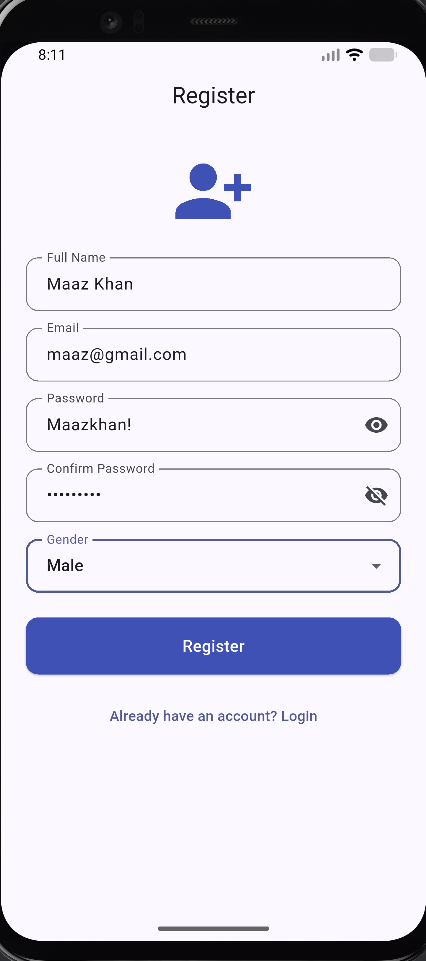
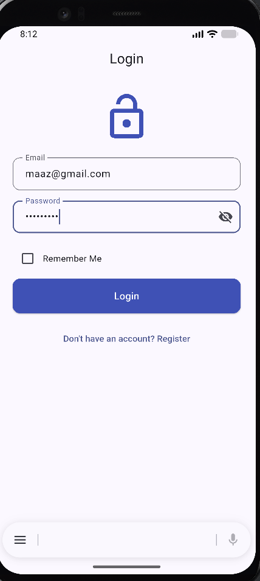
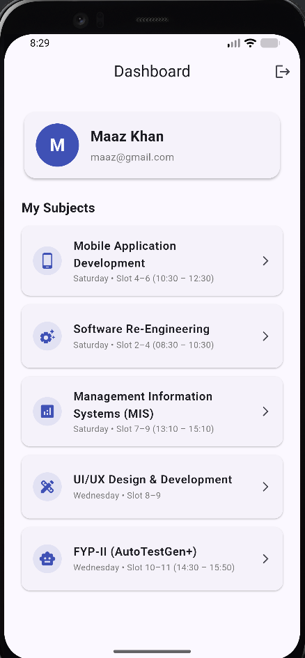
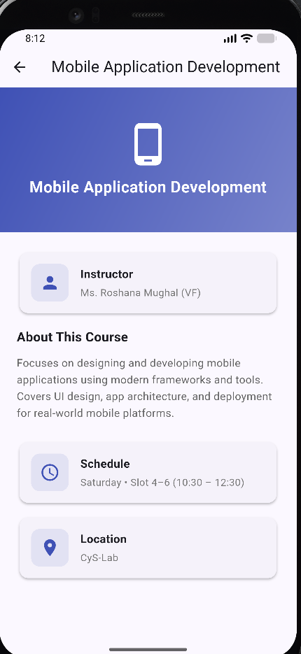
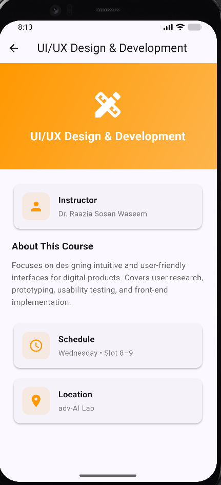
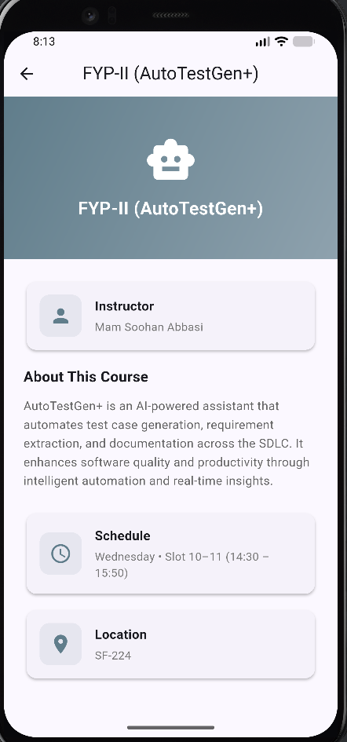

# 📱 Flutter Multi-Screen App

## 📘 Overview

A complete **multi-screen Flutter application** featuring **user authentication**, **form validation**, **navigation**, and **course management** — built as a **coding assessment project** demonstrating professional Flutter development skills.

The app implements a full **registration → login → dashboard → detail** flow with **comprehensive input validation**, **separated business logic**, **reusable components**, and **clean architecture** following industry best practices.

The focus is on **clean code**, **proper separation of concerns**, and **interview-ready architecture** — covering enums, custom validators, controllers, and widget reusability.

---

💼 This project is part of my **Mobile Application Development** coursework, highlighting **Flutter UI development**, **state management**, and **multi-screen navigation proficiency**.

---

## 🏗️ Architecture

```
lib/
├── main.dart                        # App entry point
├── models/
│   ├── user_model.dart              # User data class
│   └── subject_model.dart           # Subject data class
├── enums/
│   └── enums.dart                   # Gender enum with labels
├── utils/
│   └── validators.dart              # Reusable static validator class
├── controllers/
│   └── auth_controller.dart         # Business logic (auth)
├── screens/
│   ├── registration_screen.dart     # Registration form + validation
│   ├── login_screen.dart            # Login + remember me
│   ├── dashboard_screen.dart        # User info + subject list
│   └── detail_screen.dart           # Subject detail view
└── widgets/
    └── custom_text_field.dart       # Reusable text field component
```

### 🧩 Layer Separation
| **Layer** | **Responsibility** |
|-----------|-------------------|
| **Models** | Type-safe data classes (`UserModel`, `SubjectModel`) for structured data handling. |
| **Enums** | `Gender` enum with display labels — avoids hardcoded strings and invalid values. |
| **Validators** | Static reusable validator class — separated from UI for testability and reuse. |
| **Controllers** | `AuthController` handles registration, login, and user lookup logic. |
| **Screens** | One file per screen with clean widget composition and navigation. |
| **Widgets** | `CustomTextField` reusable component — eliminates code duplication across forms. |

---

## 📸 Screenshots

### 🔐 Authentication Flow
<p align="center">
  
  &nbsp;&nbsp;&nbsp;
  
  &nbsp;&nbsp;&nbsp;
  
</p>
<p align="center">
  <em>Registration Screen → Login Screen → Dashboard Screen</em>
</p>

### 📚 Subject Detail Screens
<p align="center">
  
  &nbsp;&nbsp;&nbsp;
  
  &nbsp;&nbsp;&nbsp;
  
</p>
<p align="center">
  <em>Mobile App Dev → UI/UX Design → FYP-II (AutoTestGen+)</em>
</p>

---

## ⚙️ Features Implemented

| **Screen** | **Key Features** |
|------------|-----------------|
| **Registration** | Full Name, Email, Password, Confirm Password, Gender dropdown with real-time validation |
| **Login** | Email/Password authentication, show/hide password toggle (eye icon), Remember Me checkbox |
| **Dashboard** | User profile card with avatar, dynamic subject list, tap navigation, logout with confirmation |
| **Detail** | Subject header with gradient banner, instructor info, course description, schedule, location |

---

## 🔒 Validation Rules

| **Field** | **Rules** |
|-----------|----------|
| **Full Name** | Required, minimum 2 characters |
| **Email** | Required, valid email format (regex validated) |
| **Password** | Minimum 6 characters, at least 1 uppercase letter, at least 1 special character |
| **Confirm Password** | Required, must match password field |
| **Gender** | Required dropdown selection |

All validation logic is centralized in a **custom `Validators` class** — separated from UI components for reusability and testability.

---

## 🗺️ Navigation Flow

```
Registration ──pushReplacement──► Login ──pushReplacement──► Dashboard ──push──► Detail
                   ↑                           ↑                                    │
                   │                           └────── Logout (pushReplacement) ◄───┘
                   │
                   └──────────── Toggle ────────────────┘
```

| **Navigation Type** | **When Used** | **Why** |
|---------------------|---------------|---------|
| `pushReplacement` | Auth screens (Register ↔ Login ↔ Dashboard) | Prevents back-button access to unauthorized screens |
| `push` | Dashboard → Detail | Allows natural back navigation to subject list |
| `pushReplacement` | Logout | Clears navigation stack so user can't press back to Dashboard |

---

## 📚 Enrolled Subjects

| **Subject** | **Instructor** | **Day** | **Timing** | **Location** |
|-------------|---------------|---------|-----------|-------------|
| Mobile Application Development | Ms. Roshana Mughal (VF) | Saturday | Slot 4–6 (10:30 – 12:30) | CyS-Lab |
| Software Re-Engineering | Mr. Conrad D'Silva / Ms. Naureen Anwar (VF) | Saturday | Slot 2–4 (08:30 – 10:30) | SF-239 |
| Management Information Systems (MIS) | Mr. Muhammad Ahmed Qaiser (VF) | Saturday | Slot 7–9 (13:10 – 15:10) | SF-240 |
| UI/UX Design & Development | Dr. Raazia Sosan Waseem | Wednesday | Slot 8–9 | adv-AI Lab |
| FYP-II (AutoTestGen+) | Mam Soohan Abbasi | Wednesday | Slot 10–11 (14:30 – 15:50) | SF-224 |

---

## 🧠 Technical Highlights

🔸 **Custom Validator Class — Separation of Concerns**
*Approach:* All validation logic in a single static class with private constructor.
*Benefit:* Reusable across screens, easy to unit test, zero UI coupling.

🔸 **Enum Implementation — Type-Safe Categorical Data**
*Approach:* `Gender` enum with `label` getter for display text.
*Benefit:* Prevents invalid values, eliminates hardcoded strings, IDE autocomplete support.

🔸 **Controller Layer — Business Logic Isolation**
*Approach:* `AuthController` manages user registration and login with static methods.
*Benefit:* UI only handles presentation; logic is testable independently.

🔸 **Reusable Widget — CustomTextField**
*Approach:* Single configurable widget for all text input fields across the app.
*Benefit:* Consistent styling, reduced code duplication, single point of change.

🔸 **Proper Resource Disposal**
*Approach:* All `TextEditingController` instances are disposed in `dispose()`.
*Benefit:* Prevents memory leaks in stateful widgets.

---

## 💡 Key Learnings & Skills Demonstrated

| **Area** | **Skills Gained** |
|----------|-------------------|
| **Flutter UI Development** | Multi-screen layouts, Material Design 3, responsive forms |
| **Form Validation** | Real-time validation, custom validators, regex-based checks |
| **Navigation** | Named and anonymous routes, push/pushReplacement strategies |
| **State Management** | StatefulWidget lifecycle, setState, controller pattern |
| **Code Architecture** | MVC-like separation — Models, Controllers, Screens, Widgets |
| **Dart Fundamentals** | Enums, static classes, null safety, private constructors |
| **Reusable Components** | Custom widgets with configurable parameters |
| **UX Best Practices** | Password visibility toggle, confirmation dialogs, snackbar feedback |

---

## 🧰 Tools & Technologies

| **Category** | **Tools / Technologies** |
|--------------|--------------------------|
| **Framework** | Flutter 3.x |
| **Language** | Dart |
| **Design System** | Material Design 3 |
| **IDE** | VS Code / Android Studio |
| **Emulator** | Android Emulator (Pixel 4 XL API 37) |
| **Web Testing** | Chrome (Flutter Web) |
| **Version Control** | Git / GitHub |

---

## 🚀 How to Run

1. **Ensure Flutter SDK is installed:**
   ```bash
   flutter --version
   ```

2. **Clone the repository:**
   ```bash
   git clone <your-repo-url>
   cd app
   ```

3. **Install dependencies:**
   ```bash
   flutter pub get
   ```

4. **Run on emulator or device:**
   ```bash
   flutter run
   ```

5. **Run on Chrome (web):**
   ```bash
   flutter run -d chrome
   ```

---

## 🎯 Assessment Checklist

| **Requirement** | **Status** |
|-----------------|-----------|
| Registration with all fields | ✅ Complete |
| Email validation | ✅ Regex validated |
| Password rules (6 chars, uppercase, special) | ✅ Complete |
| Confirm password matching | ✅ Complete |
| Gender dropdown with enum | ✅ Enum implemented |
| All fields required | ✅ Validated |
| Login with email/password | ✅ Complete |
| Show/hide password toggle | ✅ Eye icon |
| Remember Me checkbox | ✅ Complete |
| Dashboard with user info + avatar | ✅ Complete |
| Subject list with tap navigation | ✅ 5 subjects |
| Logout → back to login | ✅ With confirmation |
| Detail screen (header, banner, description, schedule) | ✅ Complete |
| Custom Validator Class | ✅ Separated |
| Enum Implementation | ✅ Gender enum |
| Controller Layer | ✅ AuthController |
| Clean folder structure | ✅ MVC-like |
| Runs without errors | ✅ Verified |

---

## 🏁 Summary

This project consolidates a complete **multi-screen Flutter application** — demonstrating **professional development practices** from **architecture design** to **form validation** to **navigation management**.

It validates expertise in **Flutter UI development**, **Dart programming**, **state management**, **input validation**, and **clean code architecture** following modern mobile development standards.

📚 Built with a focus on **code quality**, **reusability**, and **interview readiness** — ready for live demonstration and code review.
